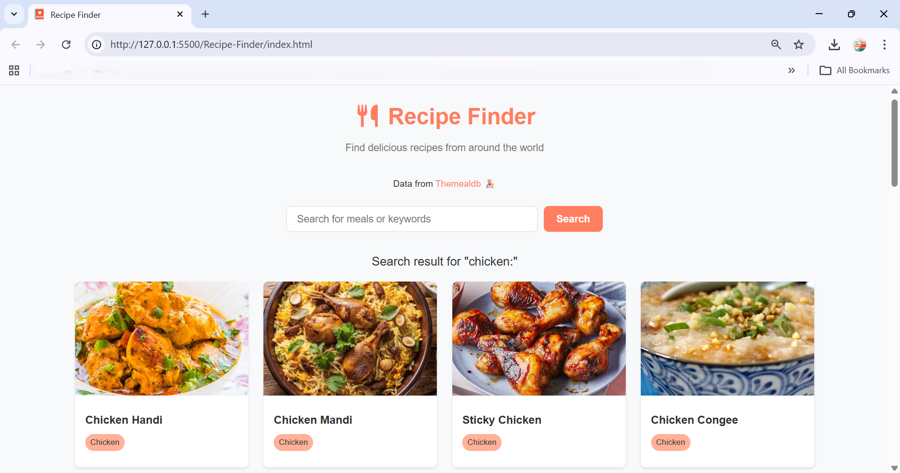

# 🍽️ Recipe Finder

A simple and beautiful web app to search and explore delicious recipes from around the world using **TheMealDB API**.

---

## 📸 Preview




---

## 🚀 Features

- 🔍 Search recipes by name or keyword
- 📋 Display list of meals with images
- 🏷️ Show meal category
- 📖 View detailed recipe instructions
- 🧾 Ingredient list with measurements
- ▶️ Watch YouTube cooking video (if available)
- ⚠️ Error handling for empty or invalid searches
- 📱 Responsive design (mobile-friendly)

---

## 🛠️ Technologies Used

- HTML5
- CSS3 (Flexbox & Grid)
- JavaScript (Vanilla JS)
- TheMealDB API

---

## 🌐 API Used

- [TheMealDB](https://www.themealdb.com/api.php)

---

## 📂 Project Structure
project/
│── index.html
│── style.css
│── javascript.js
│── favicon.png
│── README.md


---

## ⚙️ How It Works

1. User enters a search term
2. App fetches data from TheMealDB API
3. Displays meals as cards
4. Clicking a meal shows:
   - Image
   - Category
   - Instructions
   - Ingredients
   - YouTube video (if available)

---

## ▶️ Getting Started

1. Clone the repository:
```bash
git clone https://github.com/your-username/recipe-finder.git
Open index.html in your browser

<p align="center">
  <b>👨‍💻 Aniket Bais</b><br>
  <a href="https://github.com/AniketBais">GitHub</a>
</p>